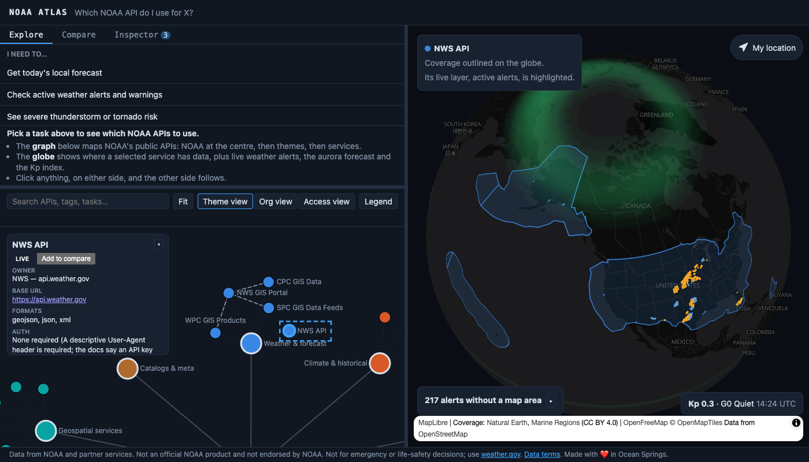

# NOAA Atlas

A linked globe and graph that answers "which NOAA API do I use for X?". **[Try it live](https://tayclark.github.io/noaa-atlas/)**.



- The **graph** is the NOAA API ecosystem: a curated set of services (owner, base URL, formats, auth, coverage, freshness, sample call) grouped by theme and connected where a documented relationship exists.
- The **globe** shows NOAA APIs in action: live layers of active National Weather Service alerts, the Space Weather Prediction Center's aurora forecast, the current Kp index, CO-OPS tide stations, DART tsunami buoys, NDBC moored buoys, nowCOAST radar, the SPC convective outlook and the GFS wind forecast, click-anywhere point lookups, and the geographic coverage of whichever service you select.
- The two are linked. Select something on one side and the other reacts.

It is a client-only single-page app. There is no backend, no accounts and no API keys; live data comes straight from `api.weather.gov`, `services.swpc.noaa.gov`, `api.tidesandcurrents.noaa.gov` and `www.spc.noaa.gov` (the convective outlook, only while its node is selected) in the browser. NOAA data and the map data keep their own terms: see [Data terms and attribution](#data-terms-and-attribution).

```sh
npm install
npm run dev     # local dev server (http://localhost:5173)
npm test        # unit tests
npm run build   # typecheck + production build
```

Requires Node 24.21 or newer (`.nvmrc`, `engines`).

## What you see

The window is split into two resizable panes: the left pane has three tabs, **Explore**, **Compare** and **Inspector**, and the right pane is the globe. Drag a divider to resize, or focus it and use the arrow keys (`Home` and `End` jump to the limits).

A slim footer under both panes carries the NOAA disclaimer (not an official NOAA product, not endorsed by NOAA, not for life-safety decisions), a link to the data terms below, and the maker's credit.

On a phone (700px wide or less, or a touch screen on its side) the panes aren't split. The views are bottom tabs at full size, **Tasks · Graph · Globe · Compare · Inspector**, so the finder and the graph each get the whole screen. Tasks, Graph and Globe load the first time you open them and then stay loaded, so switching tabs keeps the graph's pan and zoom, the picked task and the map, and a phone that never opens the Globe never fetches its data. Graph and Globe show a dot when a selection made elsewhere has changed what they show. The footer shrinks to one line, with the full disclaimer, the data terms and the credit behind **About** (or the ⓘ in the header). On a narrow globe the alerts box and the Kp readout stack at the bottom, and the map credits start folded behind the ⓘ button. Held on its side, a phone gets the whole height: the header and footer give way (the title stays for screen readers), the tabs become a rail down the left with **About** at its foot, the node detail is an always-open panel down the right that the graph frames the selection beside, and the globe's selection card shrinks to its title. In the Compare tab the row labels stay in view while a wide table scrolls sideways. A touch tablet wider than 700px keeps the two-pane layout, with the same finger-sized controls. While another tab shows, the globe does no background work: the radar loop and the space-weather polling pause (the aurora and Kp refresh at once on return if they are stale), and a selection made meanwhile is framed when the Globe tab is seen, once, without undoing where you had panned. The radar slider has **‹** and **›** buttons to step one frame at a time (a frame is about a pixel of a phone-sized track) and a 44px-tall slider. The globe opens zoomed out to fit the contiguous US across the screen (a desktop pane keeps its zoom), two fingers pan and zoom it but don't tilt or twist it, and a tap on it keeps the selected service's radar or buoys on screen instead of hiding them. The Tasks tab drills down: the list of tasks, then a page for the picked task with its steps, **Show on graph**, **Show on globe** and **Compare these**, and a Back button to the list. A selected node's detail is a bottom sheet over the Tasks and Graph tabs (see below), not a card over the graph. On a touch screen buttons and fields are at least 44px tall and the search field is 16px, so iOS doesn't zoom into it.

## Explore tab

Explore stacks the task finder above the graph, with a draggable divider between them, so picking a task highlights its path in the graph without switching tabs.

### "I need..." task finder

A list of common tasks under **I need to…** ("Get today's local forecast", "Get deep-ocean tsunami buoy readings", "Look up historical daily temperature or rainfall for a station", and so on). Until you pick one, the space below the list explains how to read the app. Picking a task:

- shows the recommended nodes as numbered steps, the first marked **Primary** and the rest **Also**, each with a one-line reason;
- highlights the whole path in the graph and draws connector lines between the steps, framing the path, or its largest group of steps when the whole path is too spread out to read (the connectors then lead off-screen to the rest);
- clicking a single step narrows the selection to that one node, which opens its detail panel and flies the globe to it.

### Graph

A force-directed graph of the curated services.

- **Nodes** form one tree: **NOAA** sits at the centre, each theme hub links to it, and every service links to its theme hub. Services are coloured by theme; the root is neutral and the largest, and theme hubs are larger than services.
- **Labels** are thinned when zoomed out: the root, theme hubs and programs keep theirs, then the best-connected services, and more appear as you zoom in. A selected node, a search match and a task's steps are always labelled.
- **Links** come in four types (see the **Legend** button): *NOAA → theme* and *Theme → service* (both derived automatically), *Shared identifiers* (services that use the same identifiers) and *Data flows into* (one service republishes or feeds another). The last two only exist where a source documents the relationship.
- **Org view** (toolbar toggle) swaps the theme layout for a tree of who runs what: NOAA, then the line office, then the program, then the service. A program hub appears only where two or more services in one office share an `owner.programGroup`; other services hang straight off their office. The hubs are drawn labels, not selectable. The **Theme view / Org view / Access view** switch in the toolbar changes layout, and Theme view restores the default.
- **Access view** groups services by how the data is reached: REST / web API, ArcGIS REST, OGC services (WMS, WMTS), cloud bucket (S3) or file download. Each service has one `accessMethod`. Services that need a token or key (`auth.type` is not `none`) get a dashed ring, since that is a separate question from the method. The hubs are drawn labels, not selectable.
- **Navigate** by dragging the background to pan, scrolling or pinching to zoom (0.25x to 4x), and, with a mouse, dragging a node to rearrange it. **Fit** re-frames the whole graph. The graph frames itself automatically until you pan or zoom, and it doesn't move a view you have moved: a resize, a dismissed selection, or the layout settling later all leave it where you put it.
- **Search** filters as you type. Every word must match somewhere in a node's name, summary, tags, formats, owner office or program, theme label, or the label of a task that uses it. Non-matches are dimmed and the match count is announced. `Esc` or the ✕ in the box clears it. On a phone the matches are also listed by name under the box (services first, six at a time, with the count above), and picking one selects it; a tap anywhere else closes the list.
- **Select** a node by clicking it, or by focusing it with `Tab` and pressing `Enter` or `Space`. The view frames the node with its neighbours.
- **On a touch screen** a finger pans and two pinch, from anywhere, including from on a node (touch doesn't drag nodes, so a pan that starts on one doesn't grab it or shake the layout). A tap selects the nearest node within about 22px of its dot, since dots are only a few pixels across and closer together than a fingertip, and a tap on nothing clears the selection and closes the legend. Taps are read by the graph itself rather than from the browser's click, which a browser withholds when the finger drifts a pixel. The phone layout swaps the toolbar's **Fit** for **+**, **−** and **Fit** buttons over the canvas, the single-pointer alternative to a pinch, and lets the legend scroll.

### Node detail panel

Selecting a node opens a panel over the graph. On a phone the same detail is a **bottom sheet** instead (over the Tasks and Graph tabs; the Globe has its own status card). It starts as a peek, a header with the name, the status tag, **Compare**, **Show on globe** and a close button, so a selection doesn't cover the view, and the graph frames the selection in the space above it. Tap the grabber, or drag the header up, to open it to nearly the full height and read the rest; drag it down to fold it, and pull it down again from the peek, or tap ✕, or press Escape, to dismiss it and clear the selection. A step picked on the Tasks tab opens it straight away, and switching tabs folds it. The detail contains:

- name and a **Live** or **Available, not live yet** tag;
- owner (NOAA office and program), base URL, formats, auth requirement, rate limits, coverage summary, freshness, and the date the entry was last verified;
- **Sample call**: the request URL, **Copy as curl** and **Copy as fetch** buttons, and a static response excerpt. Nodes with a live client (the NWS API, the SWPC planetary K-index, and the SWPC scales and alerts, solar wind and GOES X-ray nodes) also get **Run sample**, which makes the real call and shows the parsed response (as a table for the SWPC try-its);
- **Relationships**: neighbours grouped by edge type, with direction, the reason for the link and a link to the source that documents it. Click a neighbour to jump to it;
- for services that are not on the map yet, the reason why;
- a link to the official docs.

Selecting a theme hub opens the same panel with a one-line description of the theme, how many of its services are live, and a list of its services. Click a service to jump to it.

Selecting the **NOAA** root opens an overview: how many services there are and how many are live, and every theme with its service count. Click a theme to jump to its hub.

## Compare tab

Pick services to line up side by side: use **Add to compare** in a service's detail panel, or **Compare these** under a task's recommended nodes. With two or more picked, the tab shows a table of auth, formats, coverage, freshness, rate limits and owner, one column per service (up to six). Remove a column with ×, or use **Clear all**. The tab's badge shows how many are picked.

## Inspector tab

A network log of every live request the app makes, to `api.weather.gov` (alerts, point lookups, forecasts, observations), `services.swpc.noaa.gov` (the aurora forecast and Kp), `www.spc.noaa.gov` (the convective outlook) and `api.tidesandcurrents.noaa.gov` (a clicked tide station's water level and predictions), newest first, capped at the last 50.

- The tab shows how many requests are logged, and a toolbar above the list has the count and a **Clear** button.
- Each row shows the status (`200 OK`, `403 Error`, `Parse error`, `Network error`), the request path and the time. Rows start collapsed.
- Clicking a row expands it in place (click again to collapse; one row is open at a time) to show the full URL, the request headers (folded) and the response.
- The response is a foldable tree: the top-level keys are shown, nested objects and arrays are folded to a summary such as `[…] 467 items`, and long arrays show 20 items at a time behind a **Show more** button. A failed call shows its error message instead.
- **Copy as curl** and **Copy as fetch** reproduce the request outside the app.

## Globe

A 3D globe (MapLibre GL, OpenFreeMap dark basemap) that opens on the continental US.

- **Active alerts layer.** Current NWS alerts are drawn as polygons coloured by severity (Extreme, Severe, Moderate, Minor, Unknown). Click a polygon for the event, affected area and effective/expiry times. Alerts that have no geometry (zone-only) cannot be drawn, so they are counted in an overlay instead ("468 alerts without a map area"). The overlay starts collapsed to that title bar; expand it to list them five at a time with a "N more" toggle. The list scrolls while the title stays in place. If the fetch fails or nothing is active, the overlay says so.
- **Aurora forecast layer.** SWPC's OVATION forecast (a global 1° grid of the chance of seeing the aurora 30 to 90 minutes from now) is drawn as a smoothed colour layer under the alerts: green for a low chance, through yellow at about 50%, to red above about 80%, whatever the zoom. It is re-fetched every 5 minutes while the tab is visible (and on returning to a tab that has been hidden longer than that); a failed refresh keeps the forecast already drawn.
- **Kp readout.** The bottom-right corner shows the latest one-minute planetary Kp estimate, its NOAA G-scale level (G0 Quiet up to G5 Extreme storm) and the time it was issued. It refreshes on the same 5-minute cycle. If SWPC can't be reached on the first load, the corner says so instead; a failed refresh keeps the last reading.
- **SPC convective outlook layer.** The SPC GIS Data node draws today's Day 1 categorical outlook (general thunderstorms through high risk) as polygons in SPC's own colours while it is selected, with a legend of the categories present. Click a polygon for its category, validity window and forecaster. The file is fetched only while the node is selected, refreshed every 10 minutes while the tab is visible, and logged in the Inspector (`src/data/spcClient.ts`). A day with no outlook areas says so.
- **DART buoys layer.** The NDBC DART node draws the 76 tsunami buoys as orange dots while it is selected, across the Pacific, Atlantic and Caribbean. Click one for its name and a link to its NDBC station page. The list is a snapshot in `src/data/dartStations.json` rather than a runtime request, so the layer adds no network traffic; refresh it with `npm run dart-stations`. A click outside the US says that NWS forecasts cover the US and its territories only, and still lists the APIs that cover the point.
- **NDBC buoys layer.** The NDBC realtime node draws its 489 moored buoys (buoy and TAO types, worldwide) as teal dots while it is selected. Click one for its name and a link to its NDBC station page. This layer is positions only, not live observations: NDBC sends no CORS headers, so the browser can't fetch its data files, and live readings need the proxy (#72). The list is a snapshot in `src/data/ndbcStations.json`; refresh it with `npm run ndbc-stations`.
- **Tide stations layer.** The 302 CO-OPS water-level stations appear as blue dots once you zoom in to a regional view (zoom 3 and up; a phone's globe opens a little below that, so pinch in first), and grow when the CO-OPS Data API node is selected. Click one for its latest water level (metres above MLLW) and today's predicted high and low tides, all in UTC. The two requests fail independently, so one can show a message (CO-OPS's own, for a station without that product) while the other still shows. The readings are preliminary and not quality-controlled, and the popup says so. The station list is a snapshot in `src/data/coopsStations.json` rather than a runtime request (CO-OPS's own list is about 780 KB); refresh it with `npm run coops-stations` when CO-OPS adds or retires a station.
- **Radar layer.** Selecting the nowCOAST web map services node draws current radar (the base reflectivity mosaic) over the globe at 70% opacity, credited to NOAA/NWS via nowCOAST in the map's attribution. It is hidden otherwise, so nothing is requested on page load. MapLibre fetches the WMS tiles itself, so these requests don't appear in the Inspector, and the layer opens on the latest frame. A time slider in the bottom-left of the globe scrubs the last ~6 hours of frames (about 4 minutes apart, read from nowCOAST's GetCapabilities while the layer is shown) and a play button loops them; playback never starts by itself. If the frame list can't be fetched, the radar still draws without the slider.
- **Click or tap anywhere for a point lookup.** A popup shows the current forecast period and the nearest station's latest observation (temperature and wind normalised to °F and mph, conditions and observation time), then the aurora chance at that spot when there is one ("Aurora: 22% chance here", with the forecast time), followed by **APIs covering this point**: the services in the graph whose coverage contains the spot. Coverage is local, so it is in the popup at once, under the forecast that is still loading. The live services are listed by name, and the rest (about thirty at most points in the US) fold into one line, "28 more available, not live yet", that opens to their names; each service's reason for not being live is in its detail. Errors (rate limiting, 403s, unexpected responses) are reported in the popup rather than failing silently. One popup is open at a time, it scrolls if it is longer than half the globe, and on a phone it spans the globe's width, above or below a ring that marks the spot. A second tap within 350ms (a double-tap zoom) isn't a second lookup, and coordinates go to the NWS at the four decimals it wants, which saves it a redirect.
- **Wind and wave layers.** Selecting the GFS (AWS) node draws the global 10 m wind forecast: a colour shading by speed (0 to 30 m/s, with a legend) under animated streaks that follow the flow. The data is NCEP's GFS 1 degree grid, read straight from the public `noaa-gfs-bdp-pds` AWS Open Data bucket. That bucket sends `access-control-allow-origin: *` and honours Range requests, so no proxy is needed: the app finds the newest published cycle (it tries the 4.5 hour old cycle, then two earlier), reads each file's `.idx` for byte offsets and fetches only the UGRD and VGRD messages (about 80 kB each, decoded in the browser by `src/data/grib2.ts`, which handles complex packing with spatial differencing). Requests appear in the Inspector. A slider in the bottom row spans the cycle's 5 days in 3-hour steps with play and **Now** buttons, and shares its time with the radar and the point timeline; between files the field is blended linearly. Nothing is requested until the node is selected. With reduced motion the streaks are drawn once and don't move.
- **Wave layer.** The **Waves** button next to the slider swaps the wind for a shading of significant wave height (0 to 12 m, with a legend; land is left clear). It reads the `HTSGW` message from the GFS-Wave 0.25 degree file in the same bucket (about 430 kB per hour, found through that file's `.idx`). The wave files lag the atmospheric ones, so their newest cycle is probed separately. They use JPEG 2000 packing (data template 5.40) with a land bitmap: `decodeGribFieldAsync` in `src/data/grib2.ts` loads a vendored copy of pdf.js's JPX decoder (`src/data/jpx`, Apache-2.0, patched to return full-precision samples) as a lazy chunk, so wind-only visits never download it. Waves use the same shared time and 3-hour steps as the wind, and nothing wave-related is requested until **Waves** is chosen.
- **Point forecast timeline.** Tapping a point, or a tide station, also opens a timeline over the globe: the NWS hourly grid for that point (`/gridpoints/{wfo}/{x},{y}`, about 7 days) as wind speed and gusts in mph, wave height in feet where the forecast office publishes it, and the hourly CO-OPS tide prediction when a tide station is within 40 km. A slider, step buttons and a play button move a cursor along the chart, and **Now** returns to the live edge. The time is shared with the radar slider, so scrubbing one moves the other (the radar snaps to its nearest frame, and shows the latest one for a time in the future). Only one control loops at a time: pressing play on one stops another's loop. The NWS wave forecast is coarse (whole-foot steps, and absent inland), so the wave row is dropped, with a note, when a point has none. On a phone the chart is left out and the controls and readout remain.
- **Taps reach a station from beside it.** One tap or click handler decides what it meant: a tide, DART or NDBC station within reach of it (about 6px for a mouse and 22px for a finger, the nearest wins), else an alert polygon under it, else a point lookup. So a station inside an alert opens the station, not both.
- **Locate me.** The **My location** button (top right; just its arrow on a narrow globe while a selection card is showing) asks the browser for your location, flies there, marks the spot with an accuracy circle and runs the same point lookup. It asks for a quick fix and accepts one from the last five minutes, since the answer is a forecast on the NWS's 2.5 km grid and regional coverage; a GPS fix would cost seconds and battery for nothing. While it waits the button pulses and says **Locating…**. If location access is blocked or times out, a note says why and suggests tapping the map instead, and the button can be tried again. MapLibre's own button does the work behind it and is hidden.
- **Linked selection.** Selecting something in the graph or finder outlines its coverage on the globe in its theme colour and flies there:
  - a service draws its own coverage; a status card says so, and either that its live layer is highlighted (the alerts layer, the aurora glow, the tide stations, the DART buoys, the NDBC buoys, the SPC outlook or the Kp readout is emphasised) or why it isn't on the map yet;
  - a theme hub draws the coverage of all its services, and a task draws every API on its path;
  - coverage that spans the antimeridian (the GOES-West view) is framed across the dateline; small outlying areas such as Guam's waters are drawn but don't pull the view out to the Pacific; and worldwide coverage tints the whole globe and zooms out in place, without moving the view. Ocean basins too wide to frame (the tsunami and DART services) zoom out centred on their own arc. The detail panel's coverage line gives the smallest longitude range, so a basin across the dateline reads like "~150°E–130°W" and worldwide coverage reads "all longitudes".

  Going the other way, clicking the globe (or an alert polygon) selects that point, highlights every graph node that covers it, and the card says how many there are.

Selection is a single shared state (a node, a globe point, or a task at any one time), so the finder, graph, detail panel and globe always agree.

## Data

The graph is authored as JSON and validated with [zod](https://zod.dev) at load time, so a malformed entry fails tests and the build rather than rendering wrong.

| File | Contents |
| --- | --- |
| `src/data/graph.json` | Service nodes and the authored edges (`shared-id`, `data-flow`). Theme hubs and theme edges are derived in `buildGraph.ts`. |
| `src/data/nceiDatasets.json`, `onestopDatasets.json`, `awsOpenDataDatasets.json` | Slim dataset snapshots listed in the detail panels of the NCEI, OneStop and AWS Open Data service nodes. The NCEI one is the full NCEI catalog; the OneStop one is a curated subset deduped against it; the AWS one holds the NOAA-managed registry entries, each on its bucket node or the registry node. |
| `src/data/tasks.json` | "I need..." tasks, each an ordered list of node ids with a one-line reason. |
| `src/data/graphSchema.ts`, `taskSchema.ts` | The schemas and the list of themes. |

The NOAA root, the theme hubs and the edges linking them are derived in `buildGraph.ts`, never authored; the id `noaa` and the `theme-` prefix are reserved. The org view's office and program hubs are derived the same way in `orgHierarchy.ts` (reserved prefixes `office-` and `program-`), and the access view's hubs in `accessHierarchy.ts` (reserved prefix `access-`).

Themes: Weather & forecast, Climate & historical, Ocean & coastal, Satellite & radar, Space weather, Models & gridded data, Hazards, Fisheries & ecosystem, Geospatial services, Catalogs & meta. A theme with no services yet still appears in the legend.

A service node records: `id`, `name`, `summary`, `owner` (office, program and an optional short `programGroup` that names a program hub in the org view), `theme`, `baseUrl`, `accessMethod` (`rest`, `ogc`, `arcgis-rest`, `cloud-bucket` or `file-download`; names the hub in the access view), `formats`, `auth` (`none`, `token` or `key`), `coverage` (a GeoJSON Polygon or MultiPolygon), `freshness` (cadence such as realtime, hourly, daily), `docUrl`, `lastVerified`, `liveLayer`, optional `rateLimits`, `sample` (URL, headers, real response excerpt) and `tags`. A node that is not a live map layer must give a `notLiveReason`. Every edge needs a `sourceUrl` documenting the relationship.

### Adding or editing services

1. Verify against the official docs and with real requests: check the response, the CORS headers (`curl -D - -o /dev/null -H "Origin: http://localhost:5173" '<url>'`) and copy a genuine excerpt into `sample.responseExcerpt`.
2. Generate coverage geometry rather than hand-writing it:
   ```sh
   npm run coverage-geometry -- --preset us-land-and-waters --out coverage.json
   ```
   Presets (`--help` lists them all):
   - `us-land-and-waters`: US states, inhabited territories and their EEZ, for services that cover both;
   - `us-waters`: the US EEZ and the US part of the Great Lakes, for water-only services;
   - `northeast-us-shelf`: the US EEZ from Cape Hatteras to the Gulf of Maine;
   - `goes-east-west`: where GOES-East or GOES-West is at least 10° above the horizon;
   - `nhc-basins`, `tsunami-basins` and `dart-basins`: ocean basins, water only, for the hurricane and tsunami services;
   - `contiguous-us`, `alaska`, `conus-alaska` (both together), `hawaii` and `worldwide`, plus the older hand-drawn `us-coastal-waters` boxes.

   `--input <file.geojson>` merges your own polygons. Output is size-limited and schema-valid. Source data is downloaded on first use to `scripts/.cache/`: Natural Earth countries and lakes (public domain), the Marine Regions EEZ, version 12 (Flanders Marine Institute, 2023, [CC BY 4.0](https://creativecommons.org/licenses/by/4.0/), https://doi.org/10.14284/632), and the Marine Regions Global Oceans and Seas, version 1 (Flanders Marine Institute, 2021, CC BY 4.0, https://doi.org/10.14284/542). The Global Oceans and Seas download is about 200 MB and can take several minutes.
3. Add the node to `graph.json`, then add or extend a task in `tasks.json` (its node ids must exist).
4. Run `npm test`: the schema and task tests fail on unknown fields, missing `notLiveReason`, duplicate ids or dangling references.

### Re-verifying the data

`npm run verify:data` makes a real GET (with an `Origin` header) to every URL in `graph.json` (base, doc, sample, rate-limit and edge source URLs) and flags HTTP errors, moved endpoints, samples of live-layer nodes without CORS, and doc pages that mention deprecation. Add `-- --out /absolute/report.json` for the full results. It needs the network, so it is a manual check and not part of CI. Bare API roots that return 400 or 404, and services whose `auth.note` already records a 403 or missing CORS, are expected flags. Only bump a node's `lastVerified` after re-checking it.

## Data terms and attribution

The graph only points at NOAA services and the app itself fetches three of them through typed clients (NWS, SWPC and CO-OPS) and draws radar tiles from a fourth (nowCOAST), so it follows the terms NOAA publishes. These were read from the pages themselves on 2026-09-30:

| Source | What the terms say | Terms |
| --- | --- | --- |
| National Weather Service (`api.weather.gov`, SPC, WPC, CPC, NHC and the other NWS-hosted services, including SWPC) | Public domain and free for any lawful purpose, as long as you don't claim it as your own, imply NOAA/NWS endorsement or affiliation, or modify it and present it as official. The user assumes the risk of use, and data and product timestamps should be checked. | https://www.weather.gov/disclaimer |
| NOAA Open Data Dissemination (the AWS-hosted GOES, NEXRAD, MRMS, JPSS, GFS, HRRR, GEFS, NBM and CORS buckets) | Open to the public and free to use. NOAA requests attribution for unaltered data, and you may not state or imply NOAA endorsement, or say modified data is original NOAA data. | https://registry.opendata.aws/noaa-goes/ (same wording on each dataset page) |
| CO-OPS Tides & Currents | Raw data has not had National Ocean Service quality control and is preliminary, for limited use with caution. Its operational forecast systems have their own disclaimer. | https://tidesandcurrents.noaa.gov/disclaimers.html |
| Marine Regions (coverage outlines on the globe) | CC BY 4.0, credited in the map's attribution bar. | see Globe |

Not read from the pages themselves: NDBC, NCEI, NOAA Fisheries (FOSS and ERDDAP), tsunami.gov, nowCOAST, Coast Survey and NGS. The pages I tried returned 403 or 404 to scripted requests, and I didn't look further. They are NOAA sites, so the general NOAA public-data policy is assumed to apply. Check each service's own page before relying on it for anything beyond reference.

The app does not modify NOAA data and does not use NOAA or NWS logos. Its footer says it isn't an official NOAA product, which covers the endorsement and "official material" conditions above. Live data shown on the globe comes straight from NWS, SWPC, CO-OPS and nowCOAST, so their timestamps are shown as they arrive.

## Live data and limits

- There are three live integrations, each through a typed client that validates every response with zod and caches successful GETs in memory for 60 seconds (both share `src/data/liveRequest.ts`):
  - `api.weather.gov` (`src/data/nwsClient.ts`). Browsers cannot set the `User-Agent` header NWS asks for, so the client sends the documented `Accept: application/geo+json` header instead. NWS rate limits or 403s surface as readable messages in the alerts overlay, point popup and Inspector.
  - `services.swpc.noaa.gov` (`src/data/swpcClient.ts`): the OVATION aurora forecast (about 1 MB), the one-minute planetary Kp, and three try-its that have no map layer and show their result as tables in the node's detail panel: the NOAA scales and latest alerts, the active spacecraft's solar wind (the file is about 3 MB, so it is fetched only when **Run sample** is clicked) and the GOES X-ray flux with its flare class. They are static files served with `access-control-allow-origin: *`, so no headers are needed.
  - `api.tidesandcurrents.noaa.gov` (`src/data/coopsClient.ts`): the water level and hi/lo predictions for a clicked station, with `access-control-allow-origin: *`. CO-OPS answers an unknown station or missing product with HTTP 200 and an `error` body, which the client returns as a message rather than a failure.
- `nowcoast.noaa.gov` (`src/components/globe/nowcoastRadarLayer.ts`) is a fourth live source with no client: MapLibre requests WMS radar tiles directly (`access-control-allow-origin: *`, about 4 minutes of caching), only while the nowCOAST node is selected. It also fetches GetCapabilities (a raw `fetch`, also not in the Inspector) for the radar's frame list.
- `noaa-gfs-bdp-pds.s3.amazonaws.com` (`src/data/gfsClient.ts`) is a fifth live source with its own small client (it is binary, so it doesn't use `liveRequest.ts`): Range requests for the GFS 10 m wind messages, only while the GFS (AWS) node is selected. Decoded fields are cached for the session and the latest-cycle lookup for 10 minutes.
- `src/components/globe/liveLayers.ts` maps each live service to the globe layer it drives (or `null` for the panel-only SWPC try-its); a test keeps it in step with `liveLayer` in `graph.json`.
- Every other service in the graph is reference data only. Its sample is a static excerpt, and it is marked "not live yet" with the reason.

## Accessibility and performance

- **Keyboard**: a skip link is the first Tab stop, and every control shows a focus ring. The view tabs move with the arrow keys, Home and End. Graph nodes are focusable and open with Enter or Space, and the pane dividers resize with the arrow keys. With the graph itself focused (Tab past the toolbar), the arrow keys pan and + / - zoom. Screen readers hear the selected node (`aria-pressed`) and a polite announcement when the selection changes, wherever it was made. Not covered: exploring the globe itself, whose content is reachable through the graph and detail panel.
- **Reduced motion**: with the OS "reduce motion" setting on, the globe jumps to its target instead of flying, the graph is laid out in one step instead of animating, and the geolocate pulse and finder scroll fade are switched off.
- **Contrast**: `src/contrast.test.ts` checks the text and accent tokens in `index.css` against WCAG AA (4.5:1 for text, 3:1 for the focus ring). `e2e/a11y.spec.ts` runs axe (WCAG A and AA) on the initial view, with a node selected, on the Inspector tab and on the phone layout's Tasks, Graph and Globe tabs, and fails on serious or critical findings.
- **Touch**: `e2e/*.mobile.spec.ts` run in a separate Playwright project that emulates a Pixel 7 (touch, a coarse pointer, 412x915), and `e2e/a11y.mobile.spec.ts` adds axe's WCAG 2.2 `target-size` rule there. axe does not measure the graph's SVG nodes.
- **Load budget**: `npm run check:budget` fails if the built JavaScript (including MapLibre's worker files) exceeds 720 kB gzip (607 kB when set; the OneStop snapshot brought it to about 658 kB, the AWS registry snapshot to about 666 kB and the DART layer to about 669 kB and the NDBC buoy snapshot to about 680 kB, the phone layout with its detail sheet to about 686 kB, and the point forecast timeline to about 693 kB the wind layer to about 698 kB and the wave layer with its lazy JPEG 2000 decoder to about 709 kB) or the CSS exceeds 19 kB gzip (15 kB when set; the phone layout's styles took it to about 17 kB and the forecast timeline to about 18 kB). Raise a limit in the same PR that adds the weight.
- **Interaction budget**: `e2e/performance.spec.ts` allows 2 s from navigation to the first graph node and 1 s from selecting a node to its detail panel, against mocked network (about 0.2 s and 0.1 s measured on the dev server). The graph keeps easing for about 6.5 s after it first appears, so settling time is not budgeted.
- **Scale**: `src/components/graph/graphScale.test.ts` runs the layout and label placement on a synthetic 1000-node graph (about 25x the real one). A simulation tick took about 2.5 ms and a label pass about 2 ms, so no optimisation was needed; the test's limits are loose and only catch a blow-up.

## Project layout

```
src/
  components/
    LeftPanel.tsx        Explore / Compare / Inspector tabs (Tasks / Graph / Globe / Compare / Inspector bottom tabs on a phone)
    AboutDialog.tsx      the full disclaimer, in the footer or (on a phone) a dialog
    SplitPane.tsx        resizable, keyboard-accessible divider
    finder/              "I need..." task finder
    graph/               graph view, search, legend, node detail, sample, relationships
    inspector/           request log viewer
    globe/               MapLibre globe, alerts, aurora and tide-station layers, Kp readout,
                         point lookup, coverage popup
  data/                  graph/task JSON + schemas, NWS, SWPC and CO-OPS clients, request log,
                         selection and view stores, coverage geometry and lookup
e2e/                     Playwright specs and fixtures
scripts/                 coverage-geometry generator, CO-OPS station, DART station, NCEI, OneStop and AWS Open Data dataset snapshots
```

Stack: React 19, TypeScript, Vite, MapLibre GL (globe), d3-force / d3-zoom / d3-drag (graph, rendered as SVG), zod (validation). There is no state library: shared state lives in small module-level stores (`selectionStore.ts`, `viewStore.ts`, `timeStore.ts`, `requestLog.ts`) read with `useSyncExternalStore`.

## Development

| Command | What it does |
| --- | --- |
| `npm run dev` | Vite dev server |
| `npm run build` | Typecheck and production build |
| `npm run typecheck` | `tsc -b` |
| `npm run lint` | oxlint |
| `npm test` | Unit tests (Vitest) |
| `npm run test:coverage` | Unit tests with a 75% gate on lines, statements, functions and branches |
| `npm run test:e2e:mocked` | Playwright against mocked NWS, SWPC and CO-OPS responses, on desktop Chrome and the Pixel 7 phone emulation |
| `npm run test:e2e:live` | Playwright tests tagged `@live` that hit the real NWS, SWPC and CO-OPS APIs |
| `npm run check:budget` | Bundle size budget, run after `npm run build` |
| `npm run coverage-geometry` | Coverage geometry generator (see above) |
| `npm run coops-stations` | Regenerates the CO-OPS station snapshot (needs the network) |
| `npm run dart-stations` | Regenerates the DART buoy snapshot (needs the network) |
| `npm run ndbc-stations` | Regenerates the NDBC buoy snapshot (needs the network) |
| `npm run ncei-datasets` | Regenerates the NCEI dataset catalog snapshot, `src/data/nceiDatasets.json` (needs the network). Each dataset links to the service node that reaches it; the detail panels of the two NCEI service nodes list them (#62, #70), and the graph search matches their names |
| `npm run aws-open-data-datasets` | Regenerates `src/data/awsOpenDataDatasets.json` (needs the network and the system `tar`). It unpacks the AWS Open Data registry repo and keeps entries whose `ManagedBy` names NOAA (no entry carries a `noaa` tag), plus a short allow list of NOAA data hosted by others, minus third-party derivatives. Each row goes to the node whose bucket host matches the entry's first S3 bucket, else to the registry node (#64) |
| `npm run onestop-datasets` | Regenerates the curated OneStop snapshot, `src/data/onestopDatasets.json` (needs the network). It takes the top hits of a dozen topic queries (the catalog has about 107k records and its search caps `offset`, so a full crawl is impossible), drops anything already in the NCEI snapshot by DOI or title, and keeps name, dates and one link. Listed under the OneStop node (#68) |

The Playwright config starts the dev server on port 5173 (reusing one if it is already running). If another app holds that port, run `npx vite --port 5199 --strictPort` and point a copy of the config at it.

`MapLibreGlobe.tsx` and `GraphView.tsx` are excluded from the coverage gate because they are imperative wrappers around MapLibre and d3; their pure logic lives in separate, unit-tested modules and the components themselves are covered by the Playwright specs.

## CI

GitHub Actions (`.github/workflows/ci.yml`) runs on every pull request and push to `main`:

- **ci**: typecheck, lint, unit tests with the coverage gate (summary posted to the run), production build, bundle size budget.
- **e2e**: Playwright (Chromium) with the report uploaded on failure.

## License

MIT, see `LICENSE`. That covers this code only: NOAA data and the third-party map data keep their own terms (see [Data terms and attribution](#data-terms-and-attribution)).

## Hosting

The site is static, so it is served from GitHub Pages at https://tayclark.github.io/noaa-atlas/. Pages is free for a public repo and needs no extra vendor or secrets. `.github/workflows/deploy.yml` runs the unit tests, builds with `VITE_BASE=/noaa-atlas/` (the Pages sub-path) and deploys on every push to `main`. The build copies MapLibre's worker to `dist/maplibre/` (`maplibreWorker` in `vite.config.ts`); without it the globe never loads in a production build.
